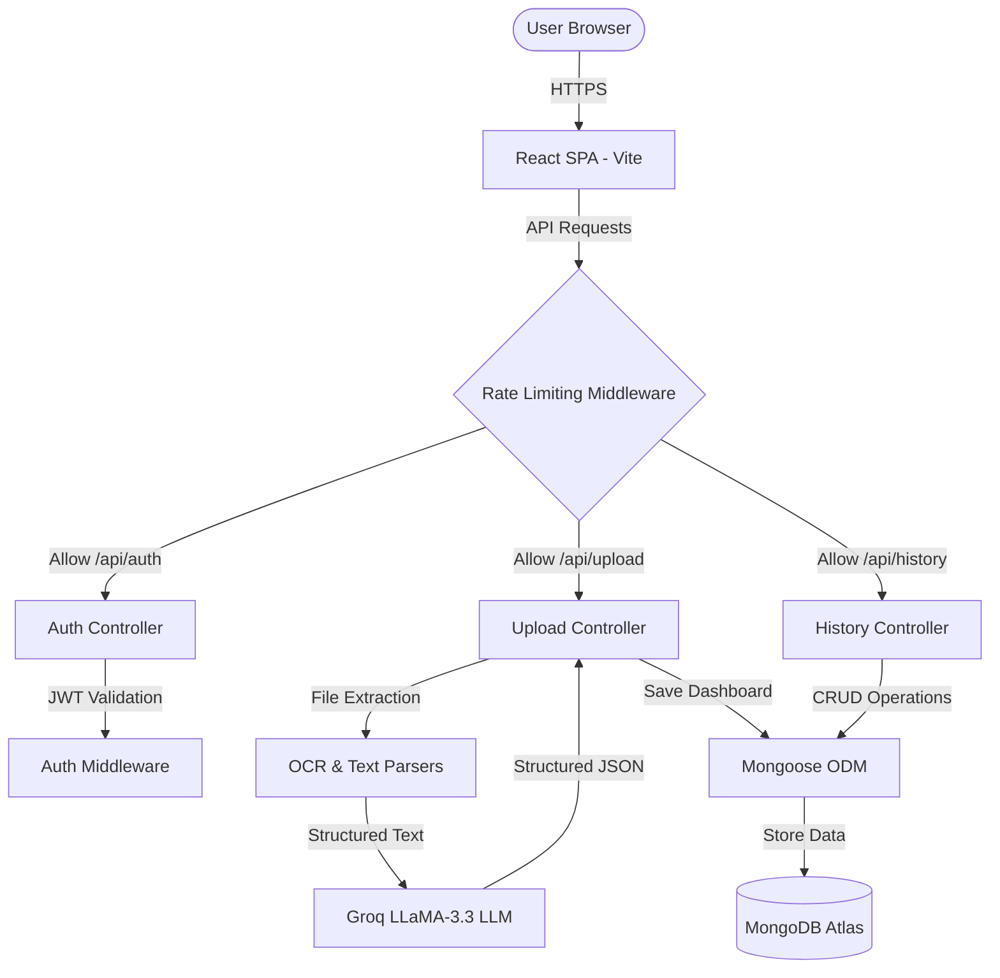

# DocDash AI 📊

> **An AI-powered B2B SaaS application that converts any unstructured document into a premium, interactive React dashboard in seconds.**

[](https://nodejs.org)
[](https://vitejs.dev)
[](https://groq.com)
[](https://mongodb.com)

---

## 🎯 The Problem Solved

Businesses waste thousands of hours manually reading PDFs, financial invoices, and messy spreadsheets to extract insights. **DocDash AI** eliminates this by acting as an autonomous data pipeline. Users can upload any unstructured document, and the AI instantly generates a highly-structured, interactive Recharts dashboard — no manual data entry, no complex prompt engineering, and no coding required.

## ✨ Core Features

- **📄 Universal Document Parsing** — Native support for PDF, Excel, CSV, JPG, and PNG formats.
- **🤖 Autonomous AI Extraction** — Powered by Groq's lightning-fast LLaMA 3.3 70B model. Forces strict JSON outputs to safely render React components without crashing the DOM.
- **📊 Dynamic Dashboards** — Auto-generates Bar, Line, Pie, and Area charts (via Recharts) alongside critical KPI summary cards based entirely on the AI's contextual understanding of the document.
- **📝 Tabbed Data Editor** — Because AI isn't flawless, users have access to a built-in, tabbed Data Editor to manually correct AI hallucinations, edit KPIs, or tweak the raw JSON array before exporting.
- **💎 Premium UI/UX** — Modern, dark-mode aesthetic featuring deep glassmorphism (`backdrop-filter`), glowing SVG pipelines, and buttery-smooth `framer-motion` page transitions.
- **🔐 Secure Authentication** — Full JWT-based auth flow (Login/Signup) with secure session management.
- **👤 User Profiles & Preferences** — Dedicated settings page for account security and mock data privacy toggles.
- **💾 Cloud Document History** — A collapsible sidebar that saves all past documents and extracted dashboards securely in MongoDB.
- **⬇️ Comprehensive Exports** — Unified export dropdown to download the final dashboard as a **PDF Report**, **PNG Image**, **CSV Tables**, or raw **JSON Data**.
  
## 🛠️ System Architecture & Tech Stack

The application is built on a decoupled **Client-Server Architecture** designed for high throughput, robust security, and clean separation of concerns.

### 🌐 System Architecture Diagram


### 💻 Technology Stack

| Layer | Technology | Role |
|-------|------------|------|
| **Frontend SPA** | React 18, Vite, Framer Motion, Lucide React | Modern dark-mode UI with fluid page transitions and SVG workflows. |
| **Data Visualization** | Recharts | Generates interactive, responsive Bar, Line, Pie, and Area charts. |
| **Export Engines** | html2canvas, jsPDF | Renders and downloads dashboards as PDF reports, PNG images, and CSV tables. |
| **Backend API Gateway** | Node.js, Express | Modular routing layer with standard CORS controls (`GET`, `POST`, `PUT`, `DELETE`). |
| **Security & Rate Limiting** | JWT (JSON Web Tokens), `express-rate-limit` | Multi-tier rate limiting (Auth: 10 req/15m, Uploads: 5 req/1m, API: 100 req/15m) to protect LLM costs and resist brute-force attacks. |
| **AI Pipeline Engine** | Groq SDK (`llama-3.3-70b-versatile`) | Strict prompt engineering to parse unstructured documents into predictable JSON dashboard schemas. |
| **Data Parsing Engines** | `pdf-parse`, `xlsx`, `csvtojson`, `tesseract.js` | Local document parsers converting PDFs, spreadsheets, and CSVs into clean plain-text streams. |
| **Persistence Layer** | MongoDB Atlas, Mongoose | Relational-like Mongoose schemas for User accounts and Document dashboards. |

## 🚀 Getting Started

### Prerequisites
- Node.js 18+
- Groq API key ([get free key here](https://console.groq.com/))
- MongoDB URI 

### 1. Backend Setup
```bash
cd backend
npm install
# Create a .env file based on the Environment Variables section below
npm start
```

### 2. Frontend Setup
```bash
cd Frontend
npm install
npm run dev
```

Open **http://localhost:5173** 🎉

## 📁 Project Structure

```text
doc-to-dashboard/
├── backend/
│   ├── server.js                  # Express entry point & CORS policy
│   ├── routes/
│   │   ├── auth.js                # Auth routes (Login, Signup)
│   │   ├── upload.js              # File upload routing
│   │   └── history.js             # Document dashboard CRUD routes
│   ├── controllers/
│   │   ├── authController.js      # Auth business logic & JWT generation
│   │   ├── uploadController.js    # Multer handling + LLM parsing integration
│   │   └── historyController.js   # DB retrieval & manual dashboard edit saves
│   ├── middleware/
│   │   ├── authMiddleware.js      # JWT token verification
│   │   └── rateLimiter.js         # Dedicated rate limiting policies
│   ├── services/
│   │   ├── aiService.js           # Groq SDK configuration & JSON schema generation prompt
│   │   └── ocrService.js          # File type validation & text parsing streams
│   └── models/
│       ├── User.js                # Mongoose Schema for accounts
│       └── Document.js            # Mongoose Schema for dashboard histories
└── Frontend/
    ├── public/
    │   └── logo.png               # Custom branding logo asset
    └── src/
        ├── App.jsx                # Router, Auth State management, & API endpoints
        ├── landing.css            # Dark mode branding design system
        ├── components/
        │   ├── Dashboard.jsx      # Recharts visual dashboard engine
        │   ├── DataEditor.jsx     # Tabbed raw data & KPI editing UI
        │   ├── ChartCard.jsx      # Generic chart container
        │   └── KPICard.jsx        # Summary metrics indicator
        └── pages/
            ├── LandingPage.jsx    # Hero page with interactive SVG data-flow animation
            └── UserProfile.jsx    # Settings page with mock privacy switches
```
## 🔑 Environment Variables
```env
# backend/.env
GROQ_API_KEY=your_groq_api_key_here
MONGODB_URI=your_mongodb_atlas_uri_here
JWT_SECRET=your_secure_random_string
PORT=5000
```